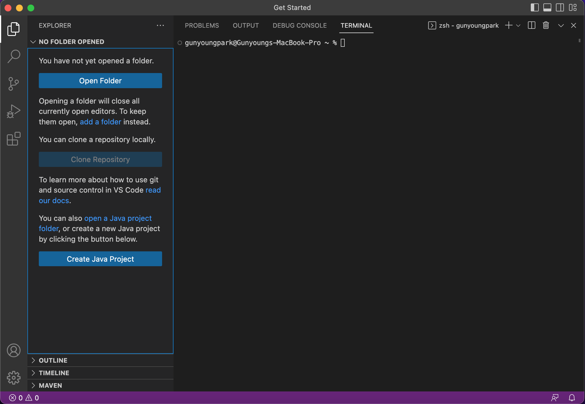
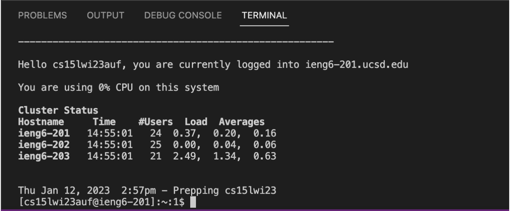
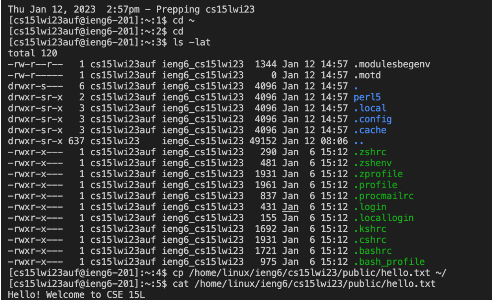
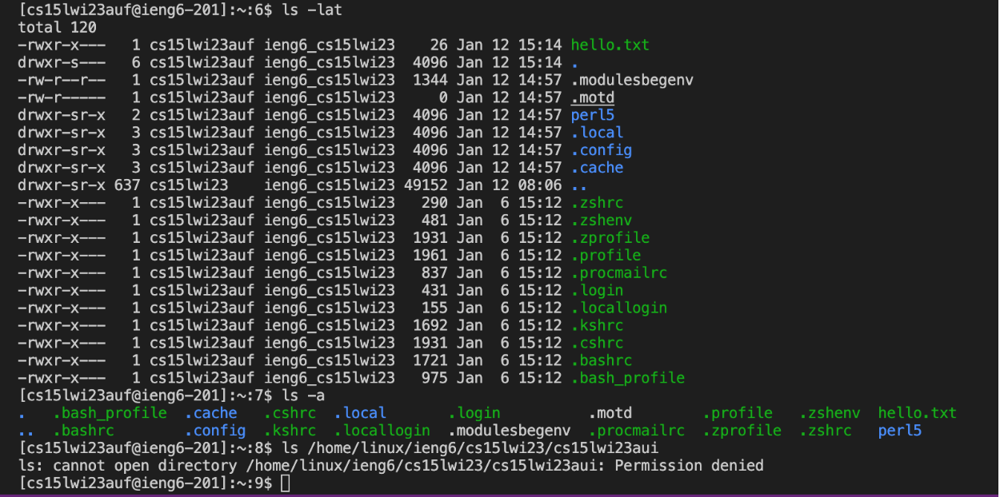

# Lab Report 1

This is a tutorial for new CSE 15L students and my future self.

It covers the process of signing in to a course-specific account on `ieng6`.

## Installing VScode

* The first step is installing **VScode**.

[Link]( https://code.visualstudio.com/)

Above is a hyperlink to Visual Studio Code website. 
Incoming 15L students can access the link and install the **VScode** by following instructions in the website.
The website contains download instructions for both *macbook* and *Windows*.

Since **VScode** was already installed on my computer, I could easily finish this step.

> An image of **VScode** opened on my computer 

## Remotely Connecting

* The second step is employing **VScode** terminal for connection to a remote computer.

Since my computer is *macbook*, I didn't have to install `git` like *Windows* users.

I followed the following substeps:

1. Open the **VScode** terminal.
 -> Click `Terminal` at the top of the screen. Then, button for 'New Terminal' will show up on the menu bar. Click it.
2. Find your CSE 15L account.
 -> Refer to the following link for instructions: [Link]( https://sdacs.ucsd.edu/~icc/index.php)
3. Reset your password.
 -> Refer to the following link for instructions: [Link]( [https://sdacs.ucsd.edu/~icc/index.php](https://docs.google.com/document/d/1hs7CyQeh-MdUfM9uv99i8tqfneos6Y8bDU0uhn1wqho/edit))
 
    It's a tutorial for resetting your password.
4. In Terminal, type in the command: `$ ssh cs15lwi23auf@ieng6.ucsd.edu`
 -> 'auf' in the command would not be for all incoming CSE 15L students. 
    Instead, they would have to type in the letters in their course-specific account.
5. Type *yes* on the terminal when the message pops up and asks whether to continue connecting. Press enter
6. Type in the password on the terminal (Don't worry even if your password isn't visible while typing. It's still being typed)

> How it looks on the terminal after being remotely connected 

## Trying Some Commands

* The last step is running the commands such as `cd`, `ls`, and `cp` on terminal.

I tried `cd ~`, `cd`, `ls -lat`, `cp`, `cat`, `cp /home/linux/ieng6/cs15lwi23/public/hello.txt ~/`, and `cat /home/linux/ieng6/cs15lwi23/public/hello.txt`.

Here are what some of these commands do:

'cd~': sets directory to be the home directory 

'cd': used to move among directories

'cp': as it seems like an abbreviation for 'copy', it copies the files or directories

I also tried `ls -lat` and `ls home/linux/ieng6/cs15lwi23/cs15lwi23aui`.

Here are the results.

> The directory contents were listed

> Permission was denied when I tried to access another student’s profile
