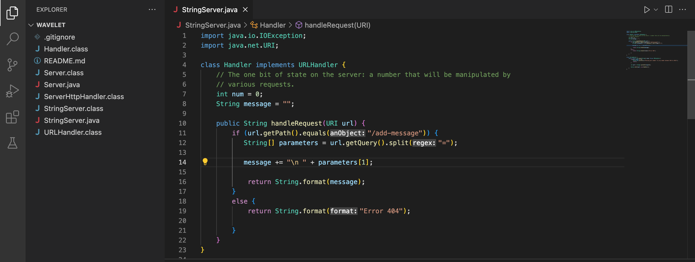

# Lab Report 2

## Part 1

> code for StringServer

> two screenshots of using /add-message

1. Which methods in your code are called?
A) split(), getQuery()

2. What are the relevant arguments to those methods, and the values of any relevant fields of the class?
A) "=",  

3. How do the values of any relevant fields of the class change from this specific request? If no values got changed, explain why.
A) 

1. Which methods in your code are called?
A) split(), getQuery()

2. What are the relevant arguments to those methods, and the values of any relevant fields of the class?
A) "=",  

3. How do the values of any relevant fields of the class change from this specific request? If no values got changed, explain why.
A) 
