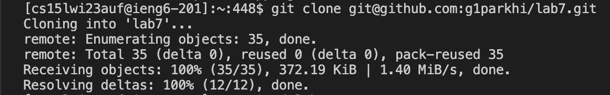

# Lab Report 4

> This lab report covers steps 4-9 for lab tasks.
> Hence, the lab7 repository is forked before Step 4. 

## Step 4: Log into ieng6

As shown on the image above, I logged into ieng6 account.

* I ran the `ssh cs15lwi23auf@ieng6.ucsd.edu` command as usual and pressed `<enter>` to log in.
* Since I generated SSH Keys for ieng6 earlier in the lab, there was no need for me to type in the password anymore.

## Step 5: Clone your fork of the repository from your Github account

I typed in `git clone git@github.com:g1parkhi/lab7.git` to clone my fork of the repository from my Github account.

* The `git clone <repository url>` command generated a local copy of remote Github repository.
  -> This would later come in handy for me to make changes in files and push it back to the remote repository
* Since I've already generated SSH Keys for Github in the earlier step of the lab, I copy-pasted the SSH URL from my github repository
  to fill in the `<repository url>` part.
* As shown on the image above, the cloning was successful.

## Step 6: Run the tests, demonstrating that they fail

I typed in `cd lab7` first to change the current working directory to lab7.
Then, I ran `javac -cp .:lib/hamcrest-core-1.3.jar:lib/junit-4.13.2.jar *.java` command and 
`java -cp .:lib/hamcrest-core-1.3.jar:lib/junit-4.13.2.jar org.junit.runner.JUnitCore ListExamplesTests`
to compile and run the tests.

* The `cd` command allowed me to change the current working directory so I can run the tests.
* Since I need to run the test using the ListExamplesTests.java file, I added `ListExamplesTests` at the end of the run command.
* As shown on the image above, the test failed. (demonstrated)

## Step 7: Edit the code file to fix the failing test

I typed in `vim ListExamples.java` in order to edit the code file.
(I typed until `vim L` and used `<tab>` to auto-complete the `ListExamples` part)

* 'vim' is basically a text editor to correct the file in a way the user wants. In this lab, it was used to fix the failing test. 

Then, the above image shows up, displaying the code that I need to fix in ListExamples.java file.

Next, I pressed `i` for insert function, which allows me to edit the code in whatever way I want by clicking the wrong part of the
code with my mouse cursor and typing in the correct code.
-> In this part, I corrected `index1` to `index2`. 

Finally, I pressed `<esc>` to opt out of the insert function and typed in `:wq`.

* `:wq` option in vim allows me to save all the changes I made in the code and exit the vim.

## Step 8: Run the tests, demonstrating that they now succeed

After coming back to the terminal using `:wq` option, 
I ran the test again by running `javac -cp .:lib/hamcrest-core-1.3.jar:lib/junit-4.13.2.jar *.java` 
and `java -cp .:lib/hamcrest-core-1.3.jar:lib/junit-4.13.2.jar org.junit.runner.JUnitCore ListExamplesTests`.

-> this time, I pressed `<up><up><up><enter>` for compile command and `<up><up><up><enter>` for run command to make use of bash history, 
expediting the process.
As shown above in the image, the tests passed this time. (demonstrated that they now succeed)

## Step 9: Commit and push the resulting change to your Github account (you can pick any commit message!)

First, I typed in `git add ListExamples.java` command to add the corrected file (which is ListExamples.java).
-> I only typed until `git add L` and used `<tab>` to auto-complete the `ListExamples` part

* `git add <file name>` command is used to add a file to the staging area.

Then, I ran `git commit -m "corrected"` command so as to commit the changes I've made in ListExamples.java file.
I chose to write down "corrected" as my commit message.

* `git commit -m "<user's commit message>"` command is used to commit the changes made in file, along with a 
  descriptive commit message that the user can write down.

Lastly, I ran `git push origin main` command, pushing the committed changes in ListExamples.java file to main branch
of the remote repository.

* `git push origin <branch>` command is used to push the committed changes made in file to the remote repository with the specific branch name.

As shown in the image above, the process was successful.

I checked the github repository. As shown above, my commit message("corrected") is displayed next to the modified ListExamples.java file.

I can see that `index1` was changed to `index2` at line 43 as intended. This proves again that commit and push were successful.

