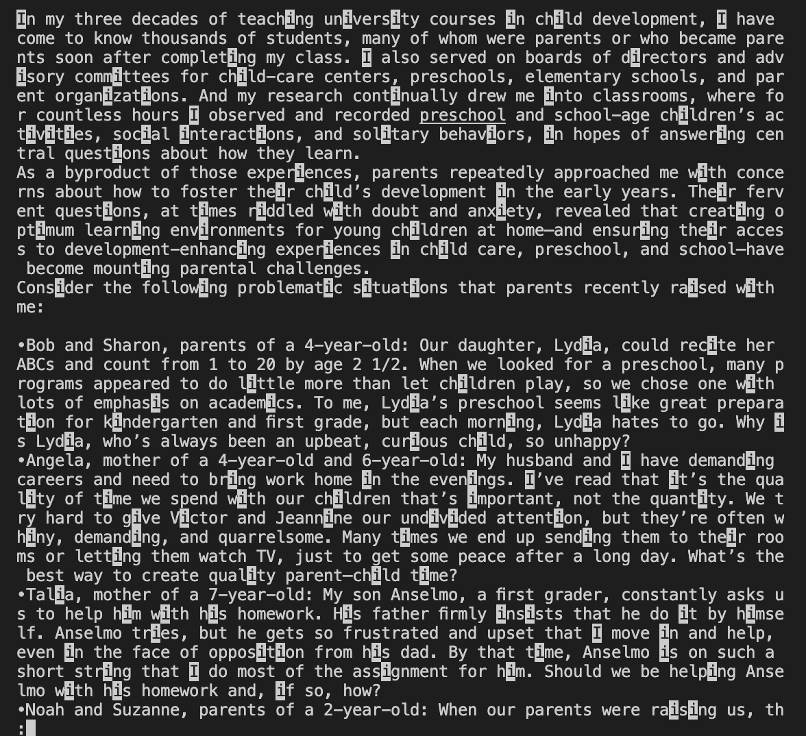
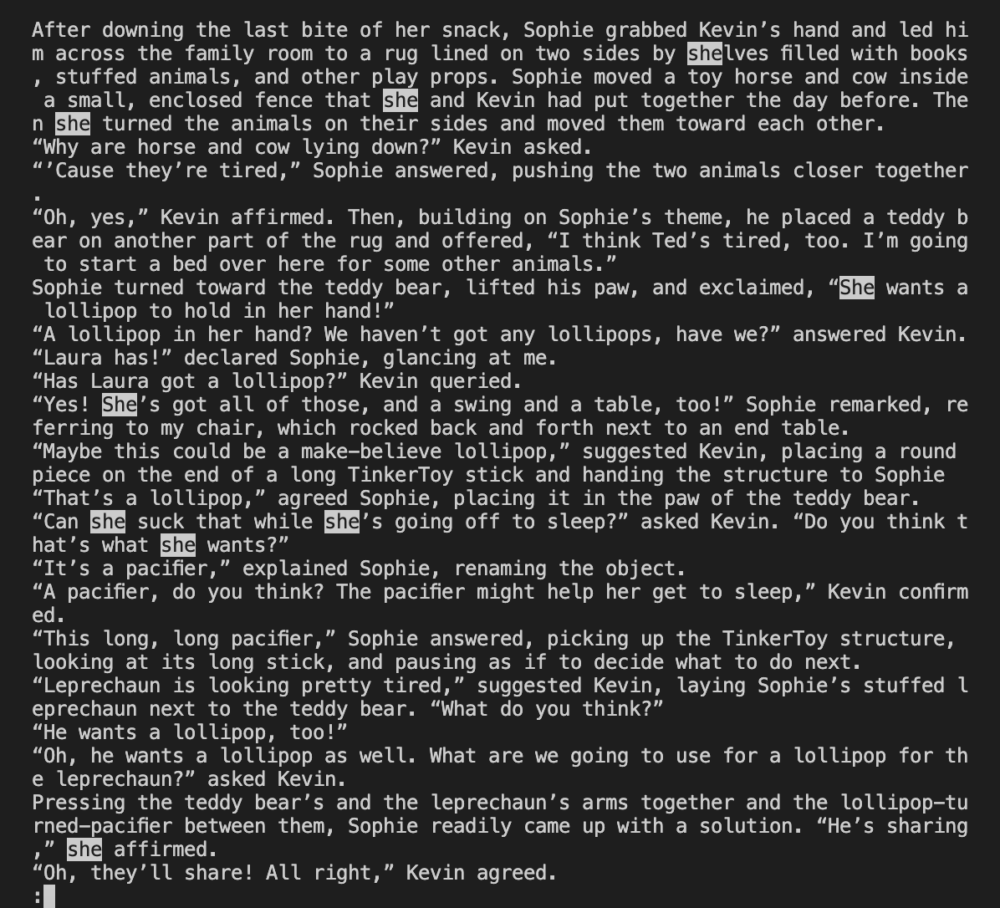
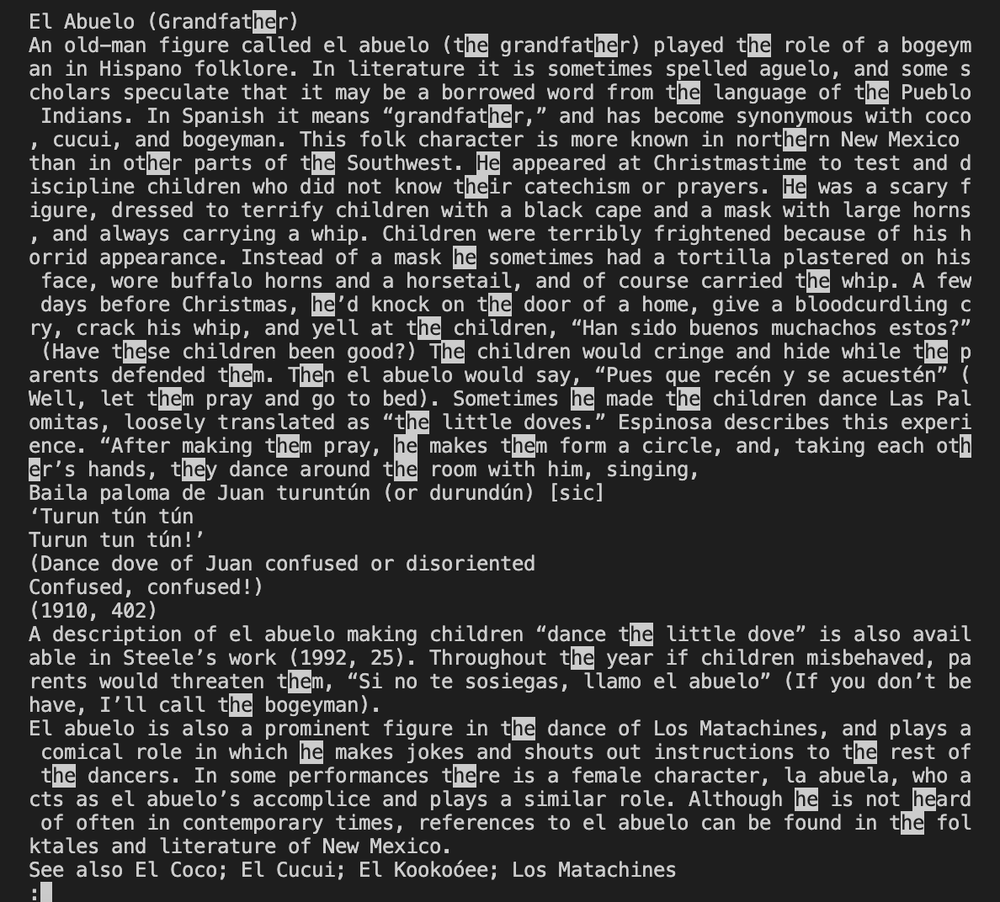
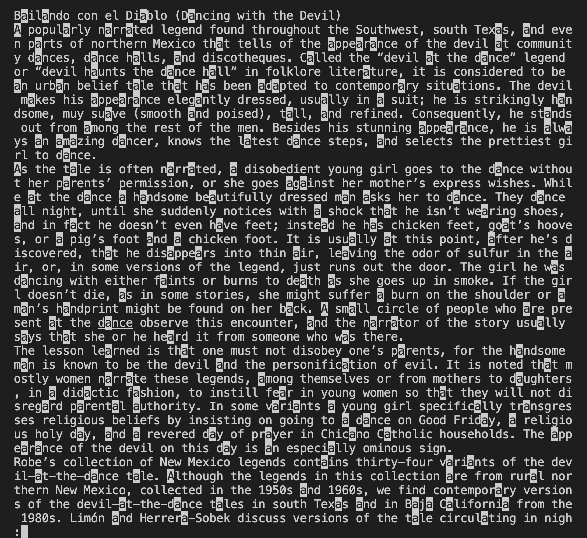
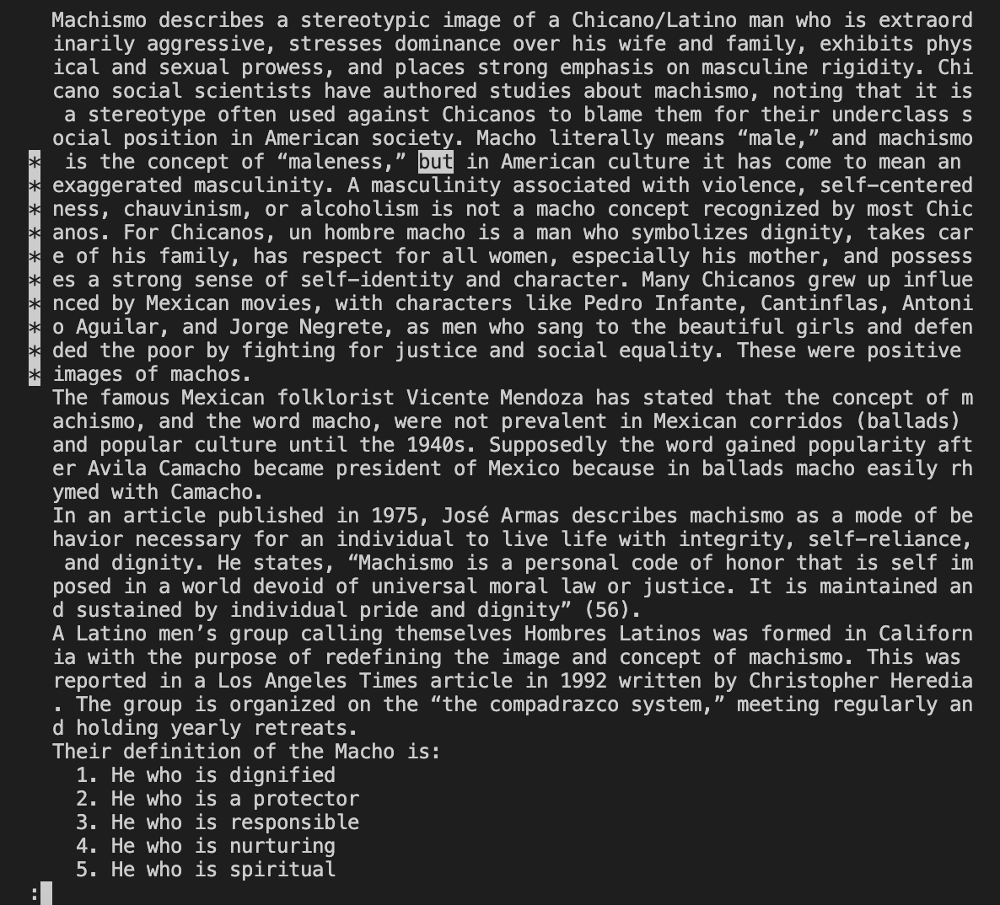
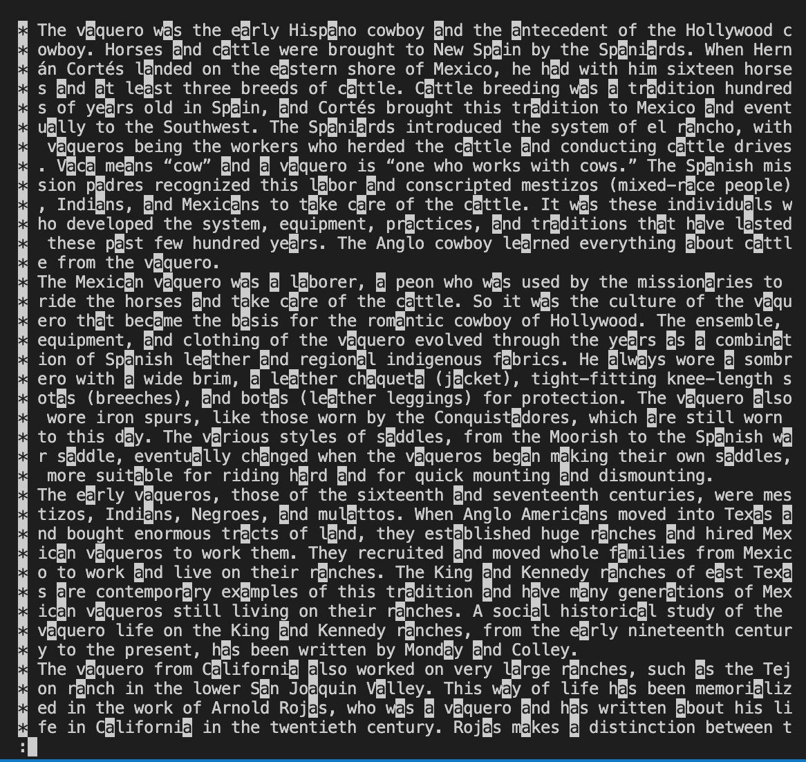
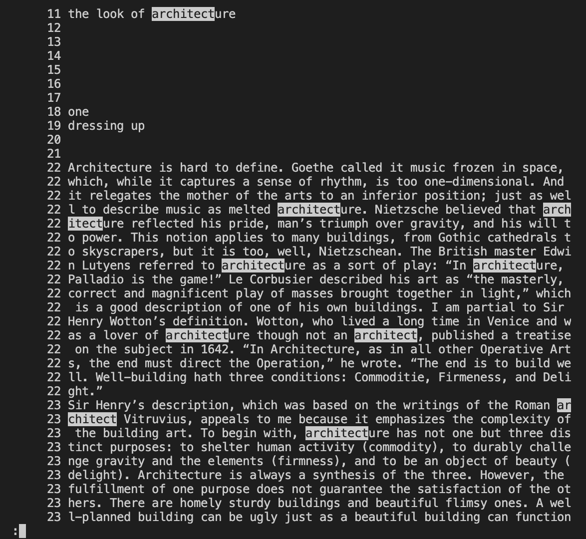
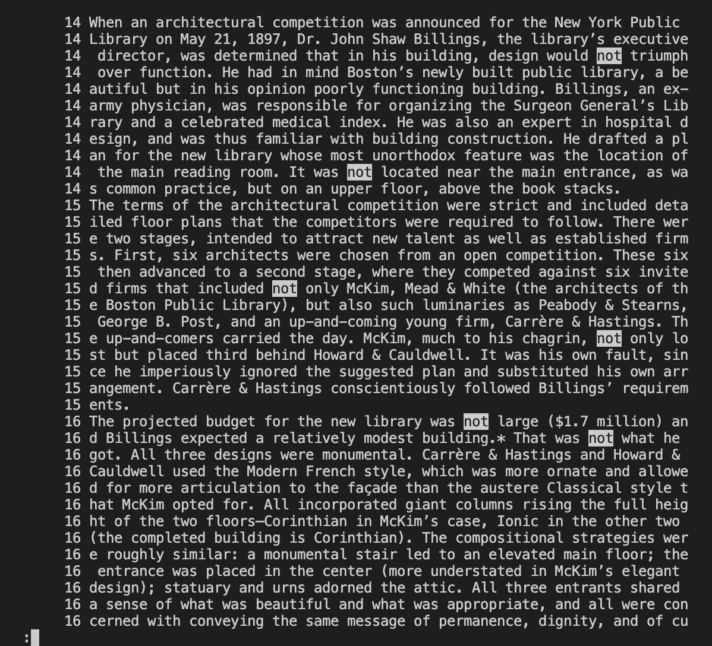

# Lab Report 5

## Command

> I will research the **less** command.

> I will demonstrate using options on files from ./written_2

## Option 1 : **-i**
> 2 examples of using **-i** on files from ./written_2

Example 1)
```
# Command
less -i ./written_2/non-fiction/OUP/Berk/ch1.txt   

/i
```
> Output



In this example, I used '-i' option for 'less' command.
The option makes the searches ignore case. So both the uppercase and lowercase letters will be treated the same and 
searched.
As shown in the output, I typed in '/i' as a search pattern to search for 'i' and both 'i' and 'I' were found.

Example 2)
```
# Command
less -i ./written_2/non-fiction/OUP/Berk/CH4.txt 

/she
```
> Output


In this example, I used '-i' option again for 'less' command.
The option makes the searches ignore case. So both the uppercase and lowercase letters will be treated the same and 
searched.
As shown in the output, I typed in '/she' as a search pattern to search for 'she' and both 'she' and 'She' were found.

Usage)
The usage of option '-i' is that it allows user to search for a word easily regardless of it being an uppercase or lowercase.
The reason '-i' command is useful is because it works like a search engine that can promptly search specific words whether they
are in uppercase or lowercase. When the user needs to do a comprehensive searching, this could definitely come in handy and save
a lot of time.
However, '-i' command bears a limitation. If the user types in an uppercase word in the search pattern, it would only search for 
that typed in uppercase word (and not the lowercase version of the typed in word). This limitation could be overcome through another 
option, which is Option 2.

Reference: 'man less' command, ChatGPT


## Option 2 : **-I**
> 2 examples of using **-I** on files from ./written_2

Example 1)
```
# Command
less -I ./written_2/non-fiction/OUP/Castro/chA.txt 

/He
```
> Output


In this example, I used '-I' option for 'less' command.
The option causes searches to ignore case, which is a similar function of the '-i' option. However, this time, even if 
I type in 'He' which contains an uppercase letter, both 'he' and 'He' will be searched.
The image above demonstrates it.

Example 2)
```
# Command
less -I ./written_2/non-fiction/OUP/Castro/chB.txt 

/A
```
> Output


In this example, I used '-I' option again for 'less' command.
The option causes searches to ignore case, which is a similar function of the '-i' option. However, this time, even if 
I type in 'A' which contains an uppercase letter, both 'A' and 'a' will be searched.
The image above demonstrates it.

Usage)
The usage of option '-I' is that it not only enables users to search for words regardless of them being an uppercase or lowercase,
but also it allows user to type in both the uppercase and lowercase for a search pattern.
The reason '-I' command is useful is because it effectively alleviates the pain of manual labor. The user can search for the words
no matter what the case of the search words are. In addition, the case of found words doesn't matter either.
These functions could easily be referred to as an automation that hugely expedites the searching process. 

Reference: 'man less' command, ChatGPT


## Option 3 : **-J**
> 2 examples of using **-J** on files from ./written_2

Example 1)
```
# Command
less -J ./written_2/non-fiction/OUP/Castro/chM.txt

/but
```
> Output


In this example, I used '-J' option for 'less' command.
The option basically shows a status column at the left edge of the vsCode screen.
Whenever there's a match between the text and the recently searched word, the status column is displayed on the left.
As shown on the image above, I searched for 'but' and the status columns were genereated at the left edge of the screen.

Example 2)
```
# Command
less -J ./written_2/non-fiction/OUP/Castro/chV.txt

/a
```
> Output


In this example, I used '-J' option again for 'less' command.
The option basically generates a status column at the left edge of the vsCode screen.
Whenever there's a match between the text and the recently searched word, the status column is displayed on the left.
As shown on the image above, I searched for 'a' and the status columns were made at the left edge of the screen.

Usage)
The usage of option '-J' is that it creates a status column at the left side of the vsCode screen,
making the matches between the search words and texts far more visible and noticeable.
The reason '-J' command is useful is because it not only highlights the search results but also alerts the user where the 
search results were found. 
This makes the search results far easier to spot and read for users.

Reference: 'man less' command, ChatGPT


## Option 4 : **-N**
> 2 examples of using **-N** on files from ./written_2

Example 1)
```
# Command
less -N ./written_2/non-fiction/OUP/Rybczynski/ch1.txt

/architect
```
> Output


In this example, I used '-N' option for 'less' command.
The option prompts line numbers to be shown at the left edge of the vsCode screen.
For every line of the text, the line number is displayed and that doesn't change even if the user searches for the words.
As shown in the above image, the line numbers are displayed and the search word 'architect' is highlighted.

Example 2)
```
# Command
less -N ./written_2/non-fiction/OUP/Rybczynski/ch3.txt

/not
```
> Output


In this example, I used '-N' option again for 'less' command.
The option prompts line numbers to be shown at the left edge of the vsCode screen.
For every line of the text, the line number is displayed and that doesn't change even if the user searches for the words.
As shown in the above image, the line numbers are displayed and the search word 'not' is highlighted.

Usage)
The usage of option '-N' is that it helps the user to better keep track of the text content as well as the search results.
The reason '-N' option is useful is because it is a very effective tool for users to locate where the searched words are 
and how the text content is formatted. So for instance, if the user wanted to locate a certain word in the text file and 
remember its found location, '-N' option provides at least an approximate marker for the user to memorize that information.
(through line numbers and highlighted search words next to them)

Reference: 'man less' command, ChatGPT
