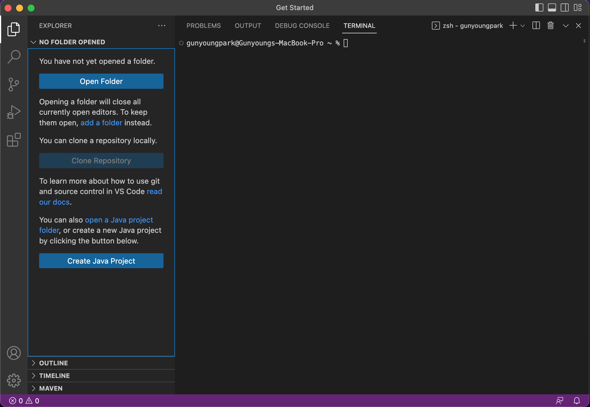
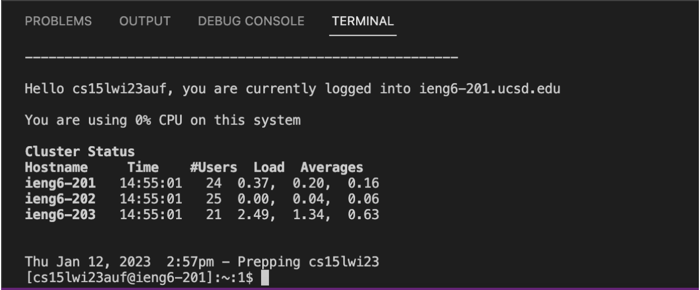
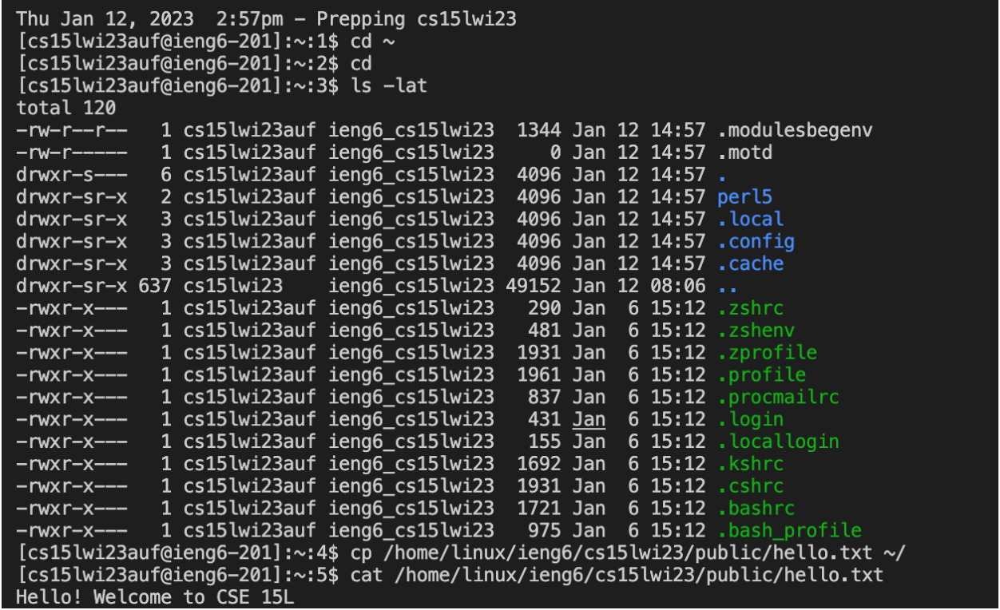

# Lab Report 1

This is a tutorial for new CSE 15L students and my future self.

It covers the process of signing in to a course-specific account on `ieng6`.

## Installing VScode

* The first step is installing **VScode**.

Since **VScode** was already installed on my computer, I could easily finish this step. 

> An image of **VScode** opened on my computer 

## Remotely Connecting

* The second step is employing **VScode** terminal for connection to a remote computer.

Since my computer is *macbook*, I didn't have to install `git` like *Windows* users.

I followed the following substeps:

1. Open the **VScode** terminal and type in the command: `$ ssh cs15lwi23auf@ieng6.ucsd.edu`
2. Type *yes* on the terminal when the message pops up and asks whether to continue connecting. Press enter
3. Type in the password on the terminal (Don't worry even if your password isn't visible while typing. It's still being typed)

> How it looks on the terminal after being remotely connected 

## Trying Some Commands

* The last step is running the commands such as `cd`, `ls`, and `cp` on terminal.

I tried `cd ~`, `cd`, `ls -lat`, `cp`, `cat`, `cp /home/linux/ieng6/cs15lwi23/public/hello.txt ~/`, and `cat /home/linux/ieng6/cs15lwi23/public/hello.txt`.

I also tried `ls -lat` and `ls home/linux/ieng6/cs15lwi23/cs15lwi23aui`.

Here are the results.

> The directory contents were listed

> Permission was denied when I tried to access another student’s profile
